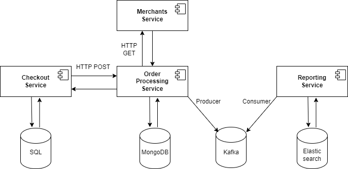
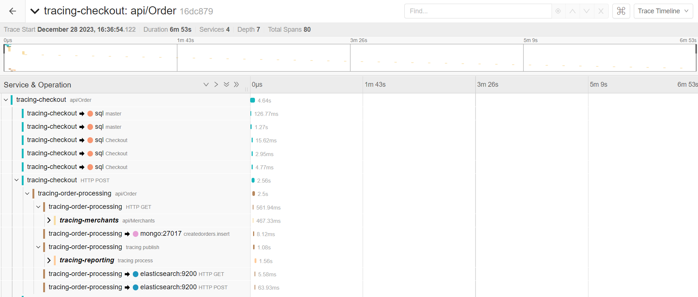

- Feature Name: Add OpenTelemetry Traces
- Start Date: 2023-12-27

# Summary
[summary]: #summary

[OpenTelemetry](https://opentelemetry.io/docs/what-is-opentelemetry/) is a collection of APIs, SDKs, and tools used to instrument, generate, collect, and export telemetry data (metrics, logs, and traces) to help the analysis of software’s performance and behavior.
This document describes the necessary steps to include OpenTelemetry tracing in C# driver.

# Motivation
[motivation]: #motivation

OpenTelemetry is the industry standard regarding telemetry data that aggregates logs, metrics, and traces. Specifically regarding traces, it allows the developers to understand the full "path" a request takes in the application and navigate through a microservice architecture.
For the .NET ecosystem, there are available implementations regarding the export of telemetry data in client-side calls in some major database management systems, being them community lead efforts ([SqlClient](https://github.com/open-telemetry/opentelemetry-dotnet/tree/main/src/OpenTelemetry.Instrumentation.SqlClient), [MongoDB](https://github.com/jbogard/MongoDB.Driver.Core.Extensions.OpenTelemetry)), or native implementations ([Elasticsearch](https://github.com/elastic/elasticsearch-net/blob/main/src/Elastic.Clients.Elasticsearch/Client/ElasticsearchClient.cs#L183)).

Cassandra has a community developed package available in the [opentelemetry-dotnet-contrib](https://github.com/open-telemetry/opentelemetry-dotnet-contrib/tree/main/src/OpenTelemetry.Instrumentation.Cassandra) that exports metrics but not traces. This proposal to include traces in the native Cassandra C# driver will allow the developers to have access to database operations when analyzing the requests that are handled in their systems when it includes Cassandra calls.

# Guide-level explanation
[guide-level-explanation]: #guide-level-explanation

## [Traces](https://opentelemetry.io/docs/concepts/signals/traces/)

As mentioned in [motivation](#motivation), traces allows the developers to understand the full "path" a request takes in the application and navigate through a microservice architecture. Traces include [Spans](https://opentelemetry.io/docs/concepts/signals/traces/#spans) which are unit of works or operation in the ecosystem that include the following information:

- Name
- Parent span ID (empty for root spans)
- Start and End Timestamps
- [Span Context](https://opentelemetry.io/docs/concepts/signals/traces/#span-context)
- [Attributes](https://opentelemetry.io/docs/concepts/signals/traces/#attributes)
- [Span Events](https://opentelemetry.io/docs/concepts/signals/traces/#span-events)
- [Span Links](https://opentelemetry.io/docs/concepts/signals/traces/#span-links)
- [Span Status](https://opentelemetry.io/docs/concepts/signals/traces/#span-status)

The spans can be correlated with each other and assembled into a trace using [context propagation](https://opentelemetry.io/docs/concepts/signals/traces/#context-propagation).

### Example of a trace in a microservice architecture

#### Architecture



#### Data visualization using Jaeger



## OpenTelemetry Semantic Conventions

### Span name

[OpenTelemetry Trace Semantic Conventions](https://opentelemetry.io/docs/specs/semconv/general/trace/) (at the time of this writing, it's on version 1.24.0) defines multipurpose semantic conventions regarding tracing for different components and protocols (e.g.: Database, HTTP, Messaging, etc.)

For C# driver, the focus is the [semantic conventions for database client calls](https://opentelemetry.io/docs/specs/semconv/database/database-spans/) for the generic database attributes, and the [semantic conventions for Cassandra](https://opentelemetry.io/docs/specs/semconv/database/cassandra/) for the specific Cassandra attributes.

According to the specification, the span name "SHOULD be set to a low cardinality value representing the statement executed on the database. It MAY be a stored procedure name (without arguments), DB statement without variable arguments, operation name, etc.".\
The specification also (and only) specifies the span name for SQL databases:\
"Since SQL statements may have very high cardinality even without arguments, SQL spans SHOULD be named the following way, unless the statement is known to be of low cardinality:\
`<db.operation> <db.name>.<db.sql.table>`, provided that `db.operation` and `db.sql.table` are available. If `db.sql.table` is not available due to its semantics, the span SHOULD be named `<db.operation> <db.name>`. It is not recommended to attempt any client-side parsing of `db.statement` just to get these properties,
they should only be used if the library being instrumented already provides them. When it's otherwise impossible to get any meaningful span name, `db.name` or the tech-specific database name MAY be used."

To avoid parsing the statement, the **span name** in this implementation has the **keyspace name** as its value.

### Span attributes

This implementation includes, by default, the **required** attributes for Database, and Cassandra spans.\
`server.address` and `server.port`, despite only **recommended**, are included to give information regarding the client connection.\
`db.statement` is optional given that this attribute may contain sensitive information:

| Attribute  | Description  | Type | Required | Supported Values|
|---|---|---|---|---|
| span.kind | Describes the relationship between the Span, its parents, and its children in a Trace. | string | true | client |
| db.system | An identifier for the database management system (DBMS) product being used. | string | true | cassandra |
| db.name | The keyspace name in Cassandra. | string | true | *keyspace in use* |
| db.statement | The database statement being executed. | string | false | *database statement in use* |
| server.address | Name of the database host. | string | true | e.g.: example.com; 10.1.2.80; /tmp/my.sock |
| server.port | Server port number. Used in case the port being used is not the default | int | false | e.g.: 9445 |

## Usage

### Package installation

The OpenTelemetry implementation is included in the package `CassandraCSharpDriver.OpenTelemetry`.

### Exporting Cassandra activity

The extension method `AddOpenTelemetryInstrumentation()` is available in the cluster builder, so the activity can be exported for database operations:

```csharp
var cluster = Cluster.Builder()
    .AddContactPoint("127.0.0.1")
    .WithSessionName("session-name")
    .AddOpenTelemetryInstrumentation()
    .Build();
```

The extension method also includes the option to enable the database statement that is disabled by default:

```csharp
var cluster = Cluster.Builder()
    .AddContactPoint("127.0.0.1")
    .WithSessionName("session-name")
    .AddOpenTelemetryInstrumentation(options => options.SetDbStatement = true)
    .Build();
```

### Capturing Cassandra activity

When setting up the tracer provider, it is necessary to include the Cassandra source for the activity to be captured. The activity source name is available in the property `CassandraInstrumentation.ActivitySourceName` that is included in the `CassandraCSharpDriver.OpenTelemetry` package.

Example:

```csharp
using var tracerProvider = Sdk.CreateTracerProviderBuilder()
 .AddSource(CassandraInstrumentation.ActivitySourceName)
 .AddConsoleExporter()
 .Build();
```

# Reference-level explanation
[reference-level-explanation]: #reference-level-explanation

## Cassandra.OpenTelemetry project

### Dependencies and target frameworks

Similar to the existent metrics feature, this functionality includes a project named `Cassandra.OpenTelemetry` that extends the core `Cassandra` project and will handle the spans'generation.\
`Cassandra.OpenTelemetry` has a single dependency from the package `System.Diagnostics.DiagnosticSource` which has the lowest non-deprecated version as [`6.0.1`](https://www.nuget.org/packages/System.Diagnostics.DiagnosticSource/6.0.1#dependencies-body-tab). Using this version it is possible to target the same .NET frameworks as the `Cassandra.AppMetrics` project which are `netstandard2.0;net461`.

**Note:** There is an alternative that uses `OpenTelemetry.Api` package to avoid code duplication, but that implies changing the minimal target framework from `net461` to `net462`. Such alternative and its drawbacks are mentioned in the section ["rationale and alternatives"](#using-opentelemetry-api-package).

### 

Proposed changes to the .NET targets (.NET Standard, .NET Framework, unified .NET) that will have to be made (if any) 

New nuget dependencies

Changes to the API of the driver

Avoid breaking changes because we are not considering a new major release any time soon.

Changes to dependencies and .NET targets should be avoided. If they can’t be avoided then we can think of some possibilities like having an interface on the main driver package and then having separate extension packages that implement that interface (we did this for the metrics feature, the App.Metrics based implementation is on a separate package on the same repo).

We can also consider changing the .NET targets of the main package if they aren’t too drastic but we can have that discussion once we know for sure if we require a recent version of .NET for this work.

Also we’re always happy to see community contributions like this. I’ll try my best to review and comment on the document and future PR in a timely fashion.

This is the technical portion of the RFC. Explain the design in sufficient detail that:

- Its interaction with other features is clear.
- It is reasonably clear how the feature would be implemented.
- Corner cases are dissected by example.

The section should return to the examples given in the previous section, and explain more fully how the detailed proposal makes those examples work.

# Drawbacks
[drawbacks]: #drawbacks

Why should we *not* do this?

# Rationale and alternatives
[rationale-and-alternatives]: #rationale-and-alternatives

## Using OpenTelemetry.Api package
[using-opentelemetry-api-package]: #using-opentelemetry-api-package

The OpenTelemetry repository for .NET describes [how to report Exceptions](https://github.com/open-telemetry/opentelemetry-dotnet/blob/main/docs/trace/reporting-exceptions/README.md) in a trace. The [option 4](https://github.com/open-telemetry/opentelemetry-dotnet/blob/main/docs/trace/reporting-exceptions/README.md#option-4---use-activityrecordexception) mentioned in the document is the preferred approach in the industry on how to record exceptions. It includes the method `RecordException()` that is available in the project `OpenTelemetry.Api` which, since version [`1.3.0`](https://www.nuget.org/packages/OpenTelemetry.Api/1.3.0), only supports the minimal version of `4.6.2` for .NET framework. Using this package in the most recent versions will imply the loss of support for .NET Framework `4.6.1`.

The method [`RecordException()`](https://github.com/open-telemetry/opentelemetry-dotnet/blob/main/src/OpenTelemetry.Api/Trace/ActivityExtensions.cs#L81) is simple enough to be replicated, and can be included in the `Cassandra.OpenTelemetry` project. As a downside, that means the Cassandra project will need to keep up with the best practices on how to report exceptions for tracing, and include code duplication. As an upside, it is possible to target .NET Framework `4.6.1`, and the reference to `OpenTelemetry.Api` is not needed which also allows the Cassandra project to not have a possible deprecated dependency depending on the evolution of reference package.

## Using OpenTelemetry.SemanticConventions package

The [semantic conventions](https://opentelemetry.io/docs/specs/semconv/) are a fast evolving reference that "define a common set of (semantic) attributes which provide meaning to data when collecting, producing and consuming it.".\
As it changes can be hard to follow, the .NET project includes a package named [`OpenTelemetry.SemanticConventions`](https://www.nuget.org/packages/OpenTelemetry.SemanticConventions/1.0.0-rc9.9) that maps the attributes defined in the conventions to a .NET project. Using this package will allow the Cassandra project to have its tracing attributes up-to-date to the conventions with less maintenance, however, as it's still marked as non-stable (current version is `1.0.0-rc9.9`), its inclusion is not included in this proposal.

# Prior art
[prior-art]: #prior-art

As mentioned in ["motivation"](#motivation) section, there are other DBMS implementations regarding the export of telemetry data in client-side calls in the .NET ecosystem:

- [SqlClient](https://github.com/open-telemetry/opentelemetry-dotnet/tree/main/src/OpenTelemetry.Instrumentation.SqlClient) (Community contribution)
- [MongoDB](https://github.com/jbogard/MongoDB.Driver.Core.Extensions.OpenTelemetry) (Community contribution)
- [Elasticsearch](https://github.com/elastic/elasticsearch-net/blob/main/src/Elastic.Clients.Elasticsearch/Client/ElasticsearchClient.cs#L183) (Native)

Cassandra also has client-side implementations in other languages in the form of contribution projects, as listed below:

- [Java](https://github.com/open-telemetry/opentelemetry-java-instrumentation/tree/main/instrumentation/cassandra) (Community contribution)
- [NodeJS](https://github.com/open-telemetry/opentelemetry-js-contrib/tree/main/plugins/node/opentelemetry-instrumentation-cassandra) (Community contribution)
- [Python](https://github.com/open-telemetry/opentelemetry-python-contrib/tree/main/instrumentation/opentelemetry-instrumentation-cassandra) (Community contribution)

# Unresolved questions
[unresolved-questions]: #unresolved-questions

- TBD

# Future possibilities
[future-possibilities]: #future-possibilities

## Traces

### Include missing Recommended attributes

As referred in ["semantic conventions section"](#semantic-conventions), there are recommended attributes that are not included in this proposal that may be useful for the users of Cassandra telemetry and can be something to look at in the future iterations of this feature:

- [Cassandra Call-level attributes](https://opentelemetry.io/docs/specs/semconv/database/cassandra/#call-level-attributes)
- [Database Call-level attributes](https://opentelemetry.io/docs/specs/semconv/database/database-spans/#call-level-attributes)
- [Database Connection-level attributes](https://opentelemetry.io/docs/specs/semconv/database/database-spans/#connection-level-attributes)

### Include customization

The implementation suggested in this document is based in SqlClient implementation regarding the attributes exposed and the inclusion of database statement as optional. However, the SqlClient implementation has other forms of customization that are not included in this document, specifically the option to [enrich](https://github.com/open-telemetry/opentelemetry-dotnet/blob/main/src/OpenTelemetry.Instrumentation.SqlClient/README.md#enrich) the activity with additional information from the raw `SqlCommand` object (for Cassandra, possibly `IStatement`).

## Metrics

As the industry is moving to adopt OpenTelemetry, the export of metrics using this standard may be something useful for the users of Cassandra C# Driver. Although the [semantic conventions for database metrics](https://opentelemetry.io/docs/specs/semconv/database/database-metrics/) are still in experimental status, there are already some community-lead efforts [available in the opentelemetry-dotnet-contrib repositories](https://github.com/open-telemetry/opentelemetry-dotnet-contrib/tree/main/src/OpenTelemetry.Instrumentation.Cassandra).
